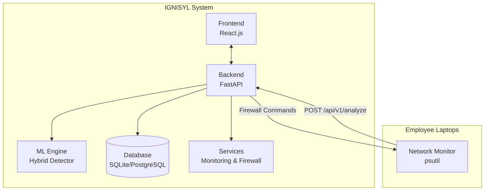
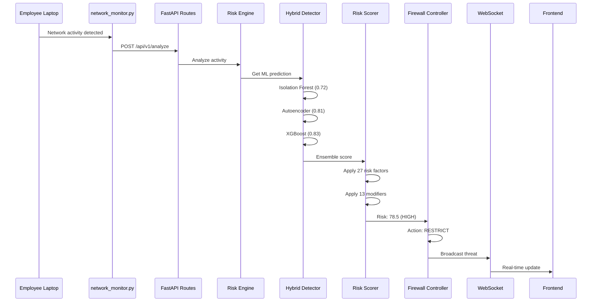
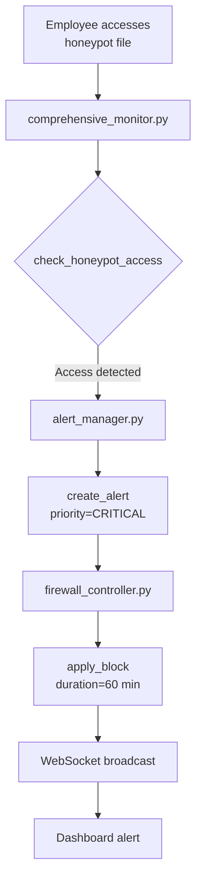
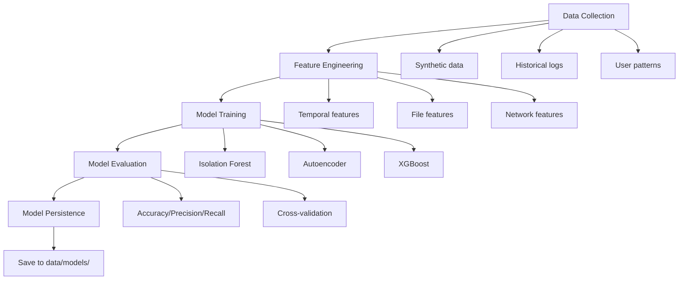
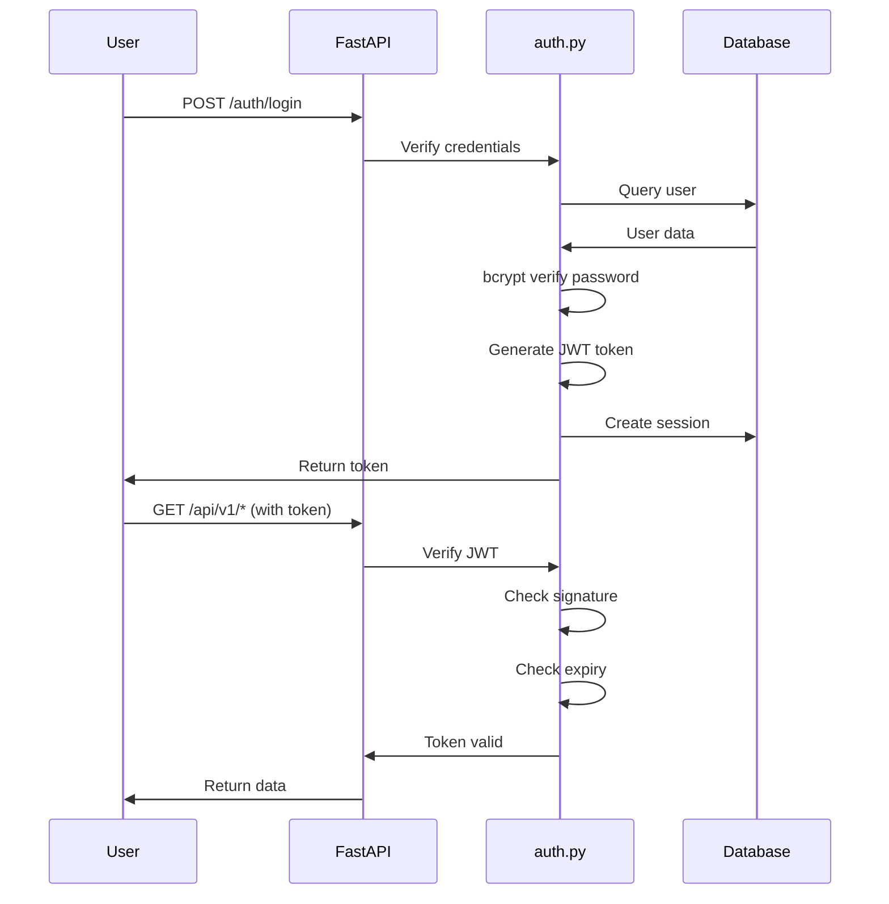
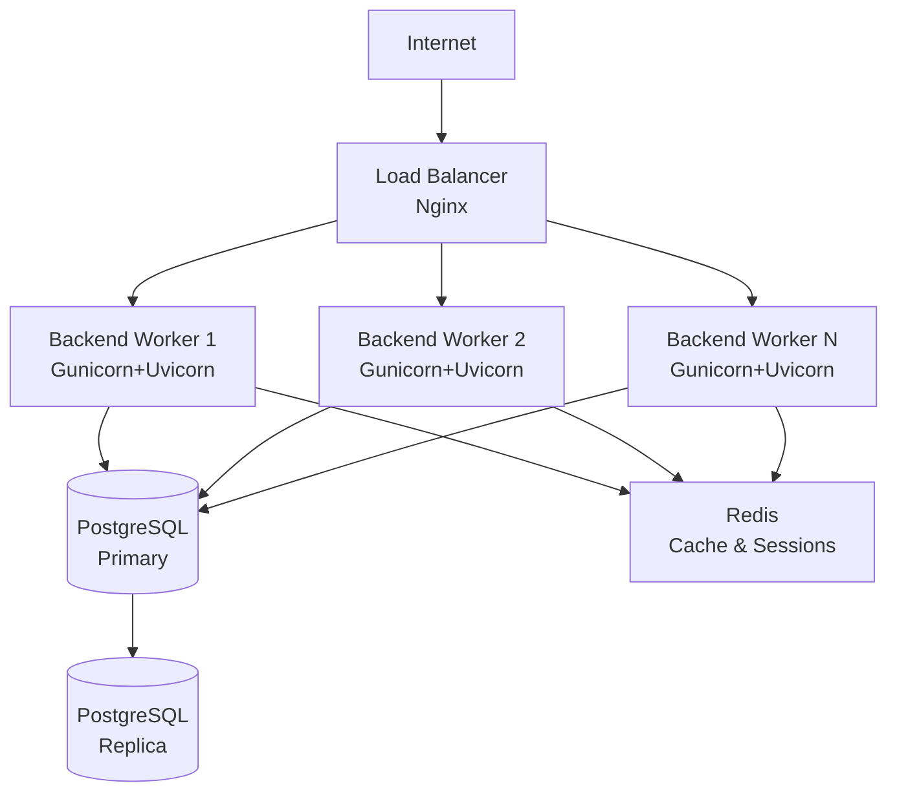

<<<START Architecture.md>>>
# IGNISYL - System Architecture

## Table of Contents
1. [Overview](#overview)
2. [High-Level Architecture](#high-level-architecture)
3. [Component Details](#component-details)
4. [Data Flow](#data-flow)
5. [ML Pipeline](#ml-pipeline)
6. [Security Architecture](#security-architecture)
7. [Deployment Architecture](#deployment-architecture)

---

## Overview

IGNISYL is an **AI-powered Insider Threat Detection and Adaptive Firewall System** built with a modular, microservices-inspired architecture.

**Tech Stack:**
- **Backend:** Python 3.11, FastAPI, SQLAlchemy
- **Frontend:** React.js, Tailwind CSS
- **ML:** scikit-learn, TensorFlow/Keras, XGBoost
- **Database:** SQLite (dev), PostgreSQL (production)
- **Real-time:** WebSockets
- **Reporting:** ReportLab (PDF generation)

---

## High-Level Architecture


---

## Component Details

### 1. Backend Components

#### Core Module (`backend/core/`)
| File | Purpose |
|------|---------|
| `main.py` | FastAPI application entry point |
| `auth.py` | JWT authentication, session management |
| `routes.py` | REST API endpoints (25+ routes) |
| `websocket.py` | Real-time WebSocket connections |
| `config.py` | Environment configuration |

#### Data Models (`backend/models/`)
| File | Purpose |
|------|---------|
| `database.py` | SQLAlchemy ORM setup |
| `user.py` | User model with RBAC |
| `activity_log.py` | Activity logging |
| `risk_assessment.py` | Risk assessment storage |
| `user_activity.py` | User activity tracking |

#### ML Engine (`backend/ml_engine/`)
| File | Purpose |
|------|---------|
| `hybrid_detector.py` | 3-model ensemble (IF + AE + XGB) |
| `risk_scorer.py` | Context-aware scoring (27 factors) |
| `model_trainer.py` | Training pipeline |

#### Services (`backend/services/`)

| File | Purpose | New Features |
|------|---------|--------------|
| `intelligent_risk_engine.py` | Real-time risk assessment | |
| `system_monitor.py` | CPU/RAM/Disk monitoring | |
| `ml_performance_tracker.py` | Model accuracy tracking | |
| `honeypot_watcher.py` | Decoy file monitoring | |
| `comprehensive_monitor.py` | Multi-vector threat detection | |
| `report_generator.py` | PDF report generation | |
| `alert_manager.py` | Alert lifecycle management | |
| `firewall_controller.py` | Adaptive firewall rules | **✨ Graduated Response Framework (5 levels)**<br>**✨ Analyst Override Controls**<br>**✨ Custom Restriction Management** |
| `log_processor.py` | SIEM-style log analysis | |
| `network_monitor.py` | Network activity monitoring | |

#### Utilities (`backend/utils/`)
- **`helpers.py`**: Common functions (formatting, hashing, time windows)
- **`validators.py`**: Input validation and sanitization

---

### 2. Frontend Structure
frontend/
├── public/                 # Static assets
├── src/
│   ├── components/         # UI components
│   ├── pages/              # Page components
│   ├── context/            # React Context
│   ├── services/           # API client
│   ├── utils/              # Helpers
│   └── App.js              # Main app
└── package.json

**Key Components:**
- **Dashboard**: Real-time threat visualization
- **User Management**: User administration
- **Activity Monitor**: Activity log viewer
- **Reports**: PDF report generation
- **Alerts**: Alert management interface

---

### 3. Data Storage
data/
├── honeypots/           # 5 decoy files
├── logs/                # Application logs
├── models/              # Trained ML models
├── reports/             # Generated PDFs
├── synthetic/           # Training data
├── activities.db        # Activity logs
├── ignisyl.db           # Main database
└── users.db             # User database

---

## Data Flow

### Activity Analysis Flow


### Honeypot Detection Flow


---

## ML Pipeline

### Training Pipeline


### Inference Pipeline

**Risk Score Calculation:**

1. **Feature Extraction** → Extract same features as training
2. **Hybrid Detector** → Run through 3 models
   - Isolation Forest: 0.72
   - Autoencoder: 0.81
   - XGBoost: 0.83
3. **Score Aggregation** → `risk_score = (0.72×0.3 + 0.81×0.3 + 0.83×0.4) × 100 = 78.5`
4. **Contextual Scoring** → Apply risk factors and modifiers
5. **Final Risk Score** → 0-100 range with risk level

---

## Security Architecture

### Authentication Flow


### Input Validation

**Multi-layer protection:**

1. **validators.py** → Regex validation, length checks, type checks
2. **Pydantic models** → FastAPI automatic validation
3. **sanitize_input()** → Remove dangerous characters
4. **SQLAlchemy ORM** → Parameterized queries (SQL injection prevention)

### Audit Trail

**All actions logged:**
- `activity_log.py` → User activities
- `logging_config.py` → System logs (10MB rotation, 5 backups)
- `risk_assessment.py` → ML predictions with reasoning
- **Retention:** 90 days default

---

## Deployment Architecture

### Development
Localhost
├── Backend: http://localhost:8000
├── Frontend: http://localhost:3000
└── Database: data/ignisyl.db (SQLite)

**Start commands:**
```bash
# Backend
cd backend
python main.py

# Frontend
cd frontend
npm start
```

### Production


**Production Stack:**
- **Web Server:** Nginx (reverse proxy, SSL)
- **WSGI Server:** Gunicorn with 4-8 Uvicorn workers
- **Database:** PostgreSQL 14+ with replication
- **Cache:** Redis 7+ for sessions
- **SSL/TLS:** Let's Encrypt certificates

---

## Scalability Considerations

### Horizontal Scaling

1. **Backend Scaling**
   - Add more Gunicorn workers
   - Multiple backend instances
   - Auto-scaling on CPU/memory

2. **Database Scaling**
   - Read replicas for SELECT queries
   - Connection pooling (pool_size=20)
   - Sharding by user_id

3. **Caching Strategy**
   - Redis for frequent queries
   - TTL: 5min (dynamic), 1hr (static)
   - Cache invalidation on updates

4. **Async Processing**
   - Celery for report generation
   - RabbitMQ message broker
   - Separate ML inference workers

5. **CDN**
   - CloudFlare/AWS CloudFront
   - Serve static frontend assets

---

## Performance Metrics

**Target SLAs:**

| Metric | Target | Notes |
|--------|--------|-------|
| API Response (p95) | < 200ms | Excluding ML inference |
| ML Inference | < 100ms | Per activity |
| WebSocket Latency | < 50ms | Message delivery |
| Report Generation | < 5s | Standard threat report |
| Concurrent Users | 1000+ | With proper scaling |
| Uptime | 99.9% | ~8.7 hrs downtime/year |

---

## Monitoring & Observability

### System Monitoring

**Metrics tracked:**
- CPU/Memory/Disk per worker
- Network bandwidth
- Active WebSocket connections

**Tools:**
- `system_monitor.py` (built-in)
- Prometheus (metrics collection)
- Grafana (dashboards)

### Application Monitoring

**Log Aggregation:**
- ELK Stack (Elasticsearch, Logstash, Kibana)
- Centralized logging
- Log levels: DEBUG → CRITICAL

**ML Performance:**
- `ml_performance_tracker.py` tracks accuracy
- Drift detection
- Auto-retraining when accuracy < 85%

---

## Technology Justification

| Technology | Why We Chose It |
|------------|----------------|
| **FastAPI** | Async support, auto docs, 3x faster than Flask |
| **React.js** | Component reusability, virtual DOM, large ecosystem |
| **SQLAlchemy** | Database agnostic, ORM abstraction, migrations |
| **scikit-learn** | Industry standard, production-ready |
| **TensorFlow** | Deep learning (Autoencoder), GPU acceleration |
| **XGBoost** | SOTA gradient boosting, handles imbalanced data |
| **WebSockets** | Real-time bidirectional communication |
| **ReportLab** | Professional PDF generation, Python native |

---

## Future Enhancements

### Roadmap (6-12 Months)

1. **Kubernetes Deployment**
   - Container orchestration
   - Auto-scaling pods
   - Self-healing

2. **Advanced ML**
   - LSTM for sequences
   - Graph Neural Networks
   - Federated learning

3. **UEBA Integration**
   - User behavior analytics
   - Peer group analysis
   - Baseline modeling

4. **SOAR Platform**
   - Automated incident response
   - Playbook execution
   - Ticketing integration

5. **Multi-Tenancy**
   - Multiple organizations
   - Tenant isolation
   - Custom branding

6. **Advanced Reporting**
   - Executive dashboards
   - Compliance reports (SOC 2, ISO 27001)
   - Custom report builder

---

## Contact & Support

For architecture questions or deployment support:

- **Email:** architecture@company.com
- **Documentation:** https://docs.ignisyl.com
- **GitHub:** https://github.com/company/ignisyl
<<<END Architecture.md>>>

