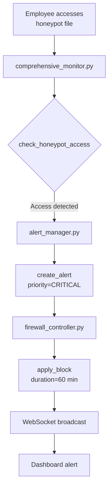
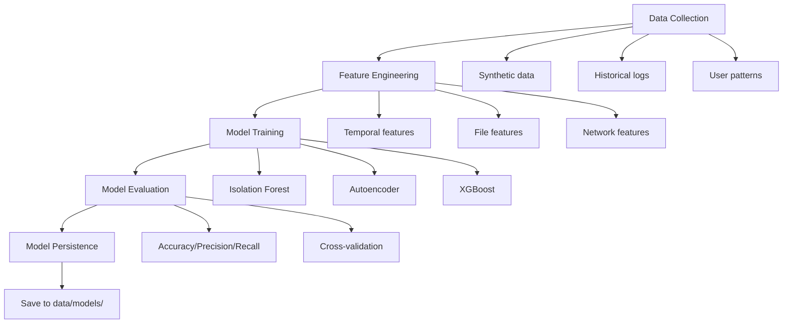
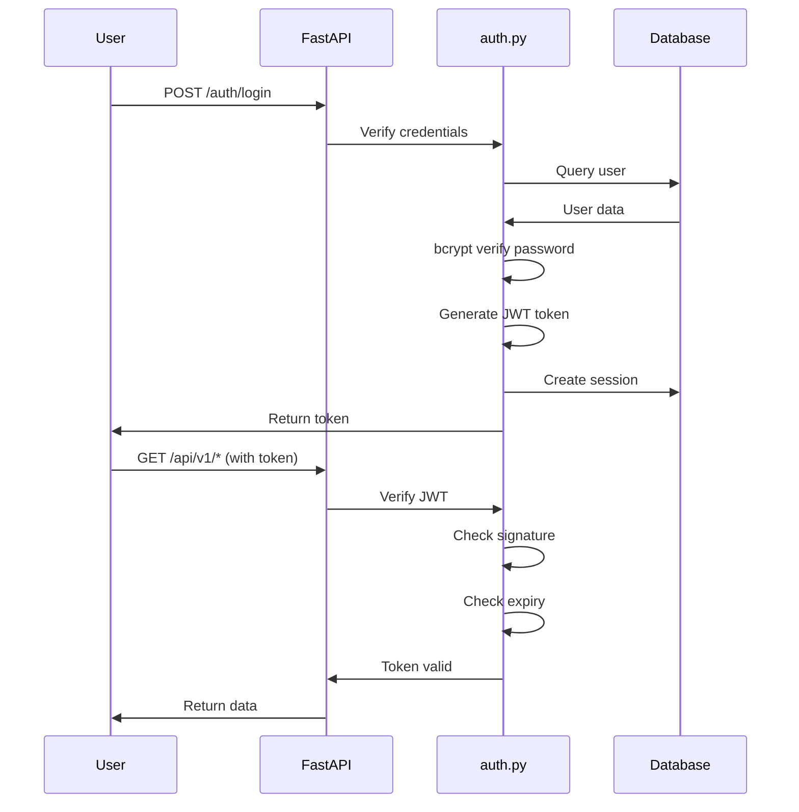

<<<START Architecture.md>>>
# IGNISYL - System Architecture

## Table of Contents
1. [Overview](#overview)
2. [High-Level Architecture](#high-level-architecture)
3. [Component Details](#component-details)
4. [Data Flow](#data-flow)
5. [ML Pipeline](#ml-pipeline)
6. [Security Architecture](#security-architecture)
7. [Deployment Architecture](#deployment-architecture)

---

## Overview

IGNISYL is an **AI-powered Insider Threat Detection and Adaptive Firewall System** designed for academic demonstration and research purposes.

> **Important: Current Version (v1.0)**
>
> This documentation describes the actual implemented system. Features marked as "Future" are planned but not yet built.

---

## Current System Architecture (v1.0)

| Component | Technology | Status |
|-----------|------------|--------|
| **Backend** | Python 3.11, FastAPI | ✅ Implemented |
| **Frontend** | React 18, Tailwind CSS | ✅ Implemented |
| **Database** | SQLite (3 databases) | ✅ Implemented |
| **ML Engine** | Ensemble (IF + XGBoost + PyTorch AE) | ✅ Implemented |
| **Reporting** | ReportLab PDF generation | ✅ Implemented |
| **Real-time** | WebSocket for dashboard | ✅ Implemented |
| **Firewall** | Command generation (simulation) | ✅ Simulation Mode |

**NOT INCLUDED IN CURRENT VERSION:**
- ❌ Endpoint agents (firewall enforcement is simulation only)
- ❌ PostgreSQL/MySQL production database
- ❌ Container orchestration (Kubernetes)
- ❌ Network-level enforcement
- ❌ SIEM/SOAR integration
- ❌ Active Directory integration

---

## Tech Stack (Implemented)

**Backend:** Python 3.11, FastAPI, SQLAlchemy
**Frontend:** React 18, Tailwind CSS
**ML:** scikit-learn, XGBoost, PyTorch (Autoencoder)
**Database:** SQLite (development mode)
**Real-time:** WebSockets
**Reporting:** ReportLab (PDF generation)

---

## High-Level Architecture
```
┌─────────────────────────────────────────────────────────────────┐
│                    IGNISYL SYSTEM (v1.0)                        │
├─────────────────────────────────────────────────────────────────┤
│                                                                 │
│  ┌──────────────┐    ┌──────────────┐    ┌──────────────┐      │
│  │   Frontend   │    │   Backend    │    │  ML Engine   │      │
│  │   React 18   │◄──►│   FastAPI    │◄──►│   Ensemble   │      │
│  │  Tailwind    │    │  WebSocket   │    │  Detector    │      │
│  └──────────────┘    └──────────────┘    └──────────────┘      │
│                             │                    │              │
│                             ▼                    ▼              │
│                      ┌──────────────┐    ┌──────────────┐      │
│                      │   Database   │    │    Models    │      │
│                      │   SQLite     │    │  .pkl/.pt    │      │
│                      └──────────────┘    └──────────────┘      │
│                                                                 │
│  ┌──────────────────────────────────────────────────────────┐  │
│  │                     Services Layer                        │  │
│  │  • Risk Scorer (27 factors + 13 business modifiers)      │  │
│  │  • Firewall Controller (4-tier graduated response)       │  │
│  │  • Report Generator (4 PDF report types)                 │  │
│  │  • System Monitor (real-time metrics)                    │  │
│  └──────────────────────────────────────────────────────────┘  │
│                                                                 │
│  ⚠️ Note: Firewall commands are SIMULATED (not executed)       │
│                                                                 │
└─────────────────────────────────────────────────────────────────┘
```

> **Note:** The current architecture is single-server deployment. There are no endpoint agents - all processing happens on the backend server.

---

## Component Details

### 1. Backend Components

#### Core Module (`backend/core/`)
| File | Purpose |
|------|---------|
| `main.py` | FastAPI application entry point |
| `auth.py` | JWT authentication, session management |
| `routes.py` | REST API endpoints (25+ routes) |
| `websocket.py` | Real-time WebSocket connections |
| `config.py` | Environment configuration |

#### Data Models (`backend/models/`)
| File | Purpose |
|------|---------|
| `database.py` | SQLAlchemy ORM setup |
| `user.py` | User model with RBAC |
| `activity_log.py` | Activity logging |
| `risk_assessment.py` | Risk assessment storage |
| `user_activity.py` | User activity tracking |

#### ML Engine (`backend/ml_engine/`)
| File | Purpose |
|------|---------|
| `hybrid_detector.py` | 3-model ensemble (IF + AE + XGB) |
| `risk_scorer.py` | Context-aware scoring (27 factors) |
| `model_trainer.py` | Training pipeline |

#### Services (`backend/services/`)

| File | Purpose | Status |
|------|---------|--------|
| `intelligent_risk_engine.py` | Real-time risk assessment | ✅ Implemented |
| `system_monitor.py` | CPU/RAM/Disk monitoring | ✅ Implemented |
| `report_generator.py` | PDF report generation (4 types) | ✅ Implemented |
| `alert_manager.py` | Alert lifecycle management | ✅ Implemented |
| `firewall_controller.py` | 4-tier graduated response | ✅ Simulation Mode |
| `honeypot_watcher.py` | Decoy file monitoring | ✅ Implemented |

**Firewall Controller Features:**
- 4-tier graduated response (ALLOW/MONITOR/RESTRICT/BLOCK)
- OS-specific command generation (Windows/Linux/macOS)
- **Simulation Mode:** Commands generated but NOT executed

#### Utilities (`backend/utils/`)
- **`helpers.py`**: Common functions (formatting, hashing, time windows)
- **`validators.py`**: Input validation and sanitization

---

### 2. Frontend Structure
frontend/
├── public/                 # Static assets
├── src/
│   ├── components/         # UI components
│   ├── pages/              # Page components
│   ├── context/            # React Context
│   ├── services/           # API client
│   ├── utils/              # Helpers
│   └── App.js              # Main app
└── package.json

**Key Components:**
- **Dashboard**: Real-time threat visualization
- **User Management**: User administration
- **Activity Monitor**: Activity log viewer
- **Reports**: PDF report generation
- **Alerts**: Alert management interface

---

### 3. Data Storage
data/
├── honeypots/           # 5 decoy files
├── logs/                # Application logs
├── models/              # Trained ML models
├── reports/             # Generated PDFs
├── synthetic/           # Training data
├── activities.db        # Activity logs
├── ignisyl.db           # Main database
└── users.db             # User database

---

## Data Flow

### Activity Analysis Flow (Current Implementation)

```
┌──────────────┐     ┌──────────────┐     ┌──────────────┐
│   Frontend   │────►│   Backend    │────►│  ML Engine   │
│  (Dashboard) │     │   FastAPI    │     │   Ensemble   │
└──────────────┘     └──────────────┘     └──────────────┘
       ▲                    │                    │
       │                    ▼                    ▼
       │              ┌──────────────┐    ┌──────────────┐
       │              │   Database   │    │ Risk Scorer  │
       │              │   (SQLite)   │    │ (27 factors) │
       │              └──────────────┘    └──────────────┘
       │                                        │
       │              ┌──────────────┐          │
       └──────────────│  WebSocket   │◄─────────┘
         Real-time    │   Updates    │   Threat Alert
                      └──────────────┘
```

**Flow:**
1. Activity data submitted via API (POST /api/v1/analyze)
2. Backend processes through ML Engine (3-model ensemble)
3. Risk Scorer applies 27 factors + 13 modifiers
4. Firewall Controller determines action (ALLOW/MONITOR/RESTRICT/BLOCK)
5. WebSocket broadcasts threat to dashboard
6. **Note:** Firewall commands generated but NOT executed (simulation mode)

### Honeypot Detection Flow


---

## Graduated Response Framework

### 4-Tier Response System (Implemented)

IGNISYL implements a **4-tier graduated response system** instead of binary ALLOW/BLOCK:

```
┌─────────────────────────────────────────────────────────────────┐
│                    RISK SCORE → RESPONSE                        │
├─────────────────────────────────────────────────────────────────┤
│                                                                 │
│   0 ──────────── 30 ──────────── 50 ──────────── 75 ──── 100   │
│   │     LOW      │    MEDIUM    │     HIGH      │  CRITICAL │   │
│   │    ALLOW     │   MONITOR    │   RESTRICT    │   BLOCK   │   │
│   │              │              │  (Analyst)    │  (Auto)   │   │
│                                                                 │
└─────────────────────────────────────────────────────────────────┘
```

### Tier Details

| Tier | Score | Action | Authority | Current Status |
|------|-------|--------|-----------|----------------|
| **ALLOW** | 0-30 | Normal logging | Automated | ✅ Implemented |
| **MONITOR** | 31-50 | Enhanced logging | Automated | ✅ Implemented |
| **RESTRICT** | 51-75 | Analyst decision | Human-in-the-loop | ✅ Implemented (simulation) |
| **BLOCK** | 76-100 | Auto-block | Automated | ✅ Implemented (simulation) |

### Tier 1: ALLOW (Risk 0-30)
- **Action:** Normal operations with standard logging
- **Authority:** Automated
- **Use Case:** Legitimate business activities

### Tier 2: MONITOR (Risk 31-50)
- **Action:** Enhanced logging, analyst awareness
- **Authority:** Automated with analyst notification
- **Use Case:** Slightly unusual but likely legitimate activity

### Tier 3: RESTRICT (Risk 51-75)
- **Action:** Analyst decision required
- **Authority:** Human-in-the-loop
- **Options:** ALLOW, RESTRICT, or BLOCK with reason
- **Use Case:** Suspicious activity requiring investigation
- **Note:** Custom restrictions (rate limiting, port blocking) planned for future

### Tier 4: BLOCK (Risk 76-100)
- **Action:** Automatic block, incident response
- **Authority:** Automated (analyst review recommended)
- **Use Case:** Critical insider threat (e.g., honeypot access)

### Analyst Workflow (Simplified)

```
Threat Detected (51-75) → Pending Queue → Analyst Review → Action Applied
                                              │
                                              ├── ALLOW (false positive)
                                              ├── RESTRICT (with reason)
                                              └── BLOCK (confirmed threat)
```

> **Simulation Mode:** All firewall actions are logged but NOT executed on actual network infrastructure.

### Research Contribution

**Novel Aspect:** Unlike traditional binary systems (ALLOW/BLOCK), IGNISYL introduces:

1. **Graduated Response:** 4 tiers instead of 2
2. **Human-in-the-Loop:** Analyst control for ambiguous cases (risk 51-75)
3. **Context-Aware Actions:** Different responses based on risk level

**Note:** Custom restrictions (granular port/bandwidth control) are planned for future versions.

## ML Pipeline

### Training Pipeline


### Inference Pipeline

**Risk Score Calculation:**

1. **Feature Extraction** → Extract same features as training
2. **Hybrid Detector** → Run through 3 models
   - Isolation Forest: 0.72
   - Autoencoder: 0.81
   - XGBoost: 0.83
3. **Score Aggregation** → `risk_score = (0.72×0.4 + 0.81×0.4 + 0.83×0.2) × 100 = 77.8`
4. **Contextual Scoring** → Apply risk factors and modifiers
5. **Final Risk Score** → 0-100 range with risk level

---

## Security Architecture

### Authentication Flow


### Input Validation

**Multi-layer protection:**

1. **validators.py** → Regex validation, length checks, type checks
2. **Pydantic models** → FastAPI automatic validation
3. **sanitize_input()** → Remove dangerous characters
4. **SQLAlchemy ORM** → Parameterized queries (SQL injection prevention)

### Audit Trail

**All actions logged:**
- `activity_log.py` → User activities
- `logging_config.py` → System logs (10MB rotation, 5 backups)
- `risk_assessment.py` → ML predictions with reasoning
- **Retention:** 90 days default

---

## Deployment Architecture

### Current Deployment (Development/Demo)

```
Localhost (Single Server)
├── Backend: http://localhost:8000 (FastAPI + Uvicorn)
├── Frontend: http://localhost:3000 (React dev server)
└── Database: SQLite (3 files in data/ and backend/data/)
```

**Start commands:**
```bash
# Backend
cd backend
python main.py

# Frontend
cd frontend
npm start
```

**Database Files:**
- `backend/data/ignisyl.db` - Main database (users, activities, alerts)
- `data/activities.db` - Activity logs
- `data/users.db` - User data

### Production Deployment (Future)

> **Note:** The following is planned but NOT currently implemented.

**Planned Production Stack:**
- Web Server: Nginx (reverse proxy, SSL)
- WSGI Server: Gunicorn with Uvicorn workers
- Database: PostgreSQL (migration scripts available)
- Cache: Redis for sessions (optional)

**Not Yet Implemented:**
- ❌ Kubernetes/container orchestration
- ❌ Load balancing
- ❌ Database replication
- ❌ Redis caching
- ❌ Endpoint agents

---

## Performance Metrics

**Target SLAs:**

| Metric | Target | Notes |
|--------|--------|-------|
| API Response (p95) | < 200ms | Excluding ML inference |
| ML Inference | < 100ms | Per activity |
| WebSocket Latency | < 50ms | Message delivery |
| Report Generation | < 5s | Standard threat report |
| Concurrent Users | 1000+ | With proper scaling |
| Uptime | 99.9% | ~8.7 hrs downtime/year |

---

## Monitoring & Observability

### System Monitoring (Implemented)

**Metrics tracked:**
- CPU/Memory/Disk usage
- Active WebSocket connections
- API response times

**Built-in Tools:**
- `system_monitor.py` - Real-time system metrics
- Dashboard System Status page

### Application Logging (Implemented)

**Log Levels:** DEBUG → INFO → WARNING → ERROR → CRITICAL
**Log Files:** Rotated automatically (10MB max, 5 backups)

### External Monitoring (Not Implemented)

> The following are planned but not currently integrated:
- ❌ Prometheus metrics collection
- ❌ Grafana dashboards
- ❌ ELK Stack log aggregation

---

## Technology Justification

| Technology | Why We Chose It |
|------------|----------------|
| **FastAPI** | Async support, auto docs, 3x faster than Flask |
| **React.js** | Component reusability, virtual DOM, large ecosystem |
| **SQLAlchemy** | Database agnostic, ORM abstraction, migrations |
| **scikit-learn** | Industry standard, production-ready |
| **TensorFlow** | Deep learning (Autoencoder), GPU acceleration |
| **XGBoost** | SOTA gradient boosting, handles imbalanced data |
| **WebSockets** | Real-time bidirectional communication |
| **ReportLab** | Professional PDF generation, Python native |

---

## Future Enhancements (Planned)

> **Note:** These features are planned for future development but are NOT currently implemented.

### High Priority
- [ ] Endpoint agent for actual firewall enforcement
- [ ] PostgreSQL production database support
- [ ] Custom restriction options (rate limiting, port blocking)
- [ ] Active Directory integration

### Medium Priority
- [ ] Docker containerization
- [ ] SIEM/SOAR integration (Splunk, QRadar)
- [ ] Advanced ML (LSTM for sequential patterns)
- [ ] Email/SMS notification delivery

### Low Priority
- [ ] Kubernetes deployment
- [ ] Multi-tenancy support
- [ ] Compliance reporting (SOC 2, ISO 27001)
- [ ] Mobile application

---

## Limitations (Current Version)

| Feature | Status | Notes |
|---------|--------|-------|
| Firewall enforcement | Simulation only | Commands generated but not executed |
| Network monitoring | Not implemented | Requires endpoint agent |
| USB control | Not implemented | Requires endpoint agent |
| Database | SQLite only | PostgreSQL migration planned |
| Scaling | Single server | No load balancing |
| Notifications | Logged only | Email/SMS not connected |

---

## Contact & Support

- **GitHub:** https://github.com/SruthiGS-Gito/Ignisyl
- **Developer:** Sruthi CS
- **Institution:** Sree Buddha College of Engineering, Kerala, India
<<<END Architecture.md>>>


